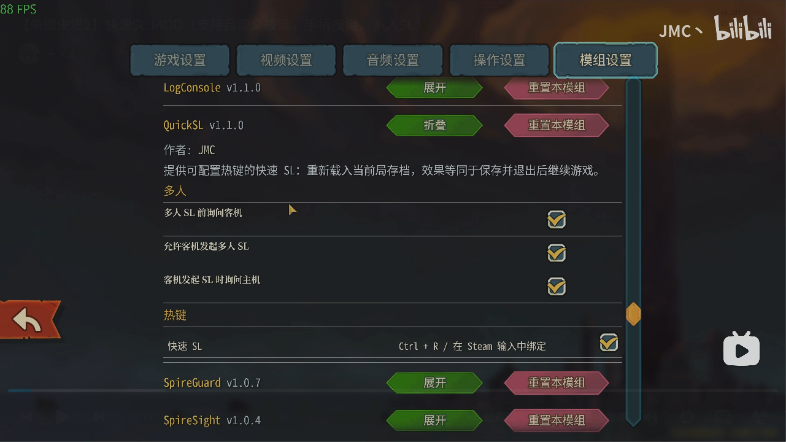
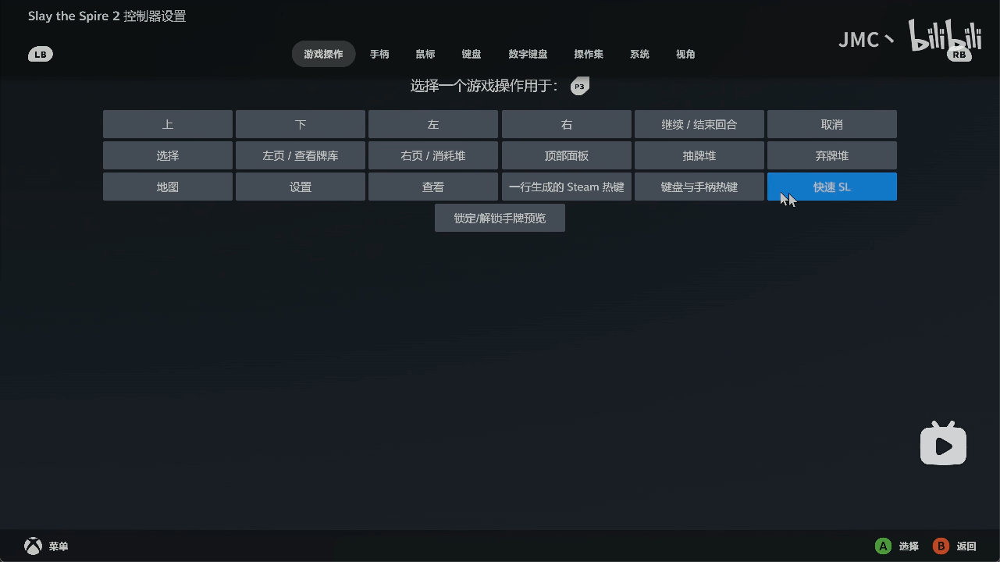
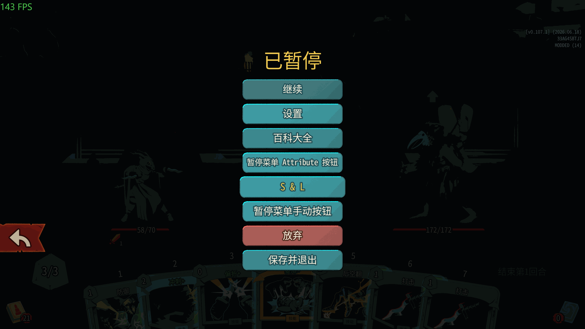
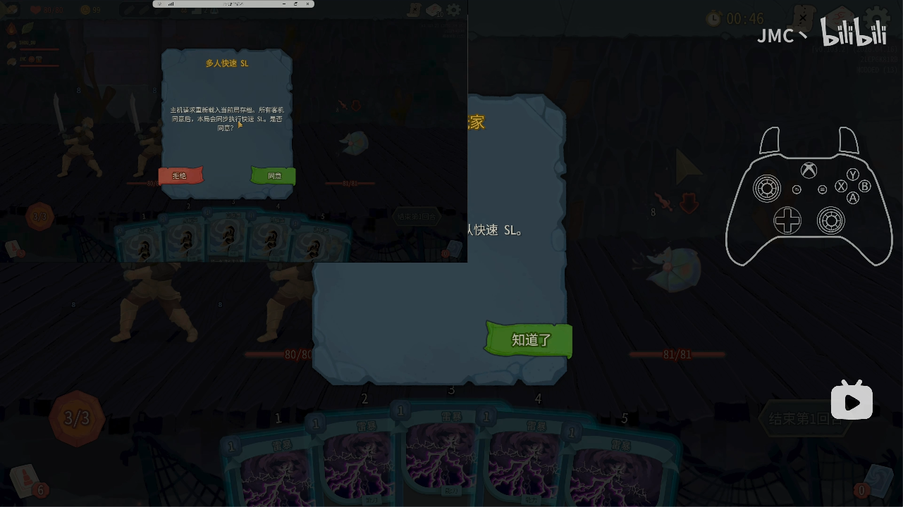

<p align="center">
  <a href="README.md"></a>
  <a href="README_en.md"></a>
  <a href="CHANGELOG.md"></a>
  <a href="CHANGELOG_en.md"></a>
  <a href="https://github.com/JMC-Mods/SlayTheSpire2_QuickSL/releases"></a>
<!-- code-stats:start -->
  <a href="https://github.com/JMC-Mods/SlayTheSpire2_QuickSL/actions/workflows/code-lines.yml"></a>
  <a href="https://github.com/JMC-Mods/SlayTheSpire2_QuickSL/actions/workflows/code-lines.yml"></a>
  <a href="https://github.com/JMC-Mods/SlayTheSpire2_QuickSL/actions/workflows/code-lines.yml"></a>
  <a href="https://github.com/JMC-Mods/SlayTheSpire2_QuickSL/actions/workflows/code-lines.yml"></a>
  <a href="https://github.com/JMC-Mods/SlayTheSpire2_QuickSL/actions/workflows/code-lines.yml"></a>
  <a href="https://github.com/JMC-Mods/SlayTheSpire2_QuickSL/actions/workflows/code-lines.yml"></a>
  <a href="https://github.com/JMC-Mods/SlayTheSpire2_QuickSL/actions/workflows/code-lines.yml"></a>
<!-- code-stats:end -->
</p>

# QuickSL
##  0. 安装

### Mod本体安装
Steam版本直接在创意工坊订阅即可

其他版本可以自行编译，或者在[📦 Releases](https://github.com/JMC-Mods/SlayTheSpire2_QuickSL/releases)界面下载.zip后解压到游戏安装目录下的Mods
目录下（没有就新建一个）

### 前置安装
**此外，本模组强依赖于模组[JmcModLib](https://github.com/JMC-Mods/SlayTheSpire2_JmcModLib/releases) `1.3.0` 或更高版本**，安装方法同上

安装完成后的目录结构如下：

```sh
-- Slay the Spire 2
    |-- SlayTheSpire2.exe
        |-- mods
             |-- JmcModLib
             |-- QuickSL
                  |-- QuickSL.dll
                  |-- QuickSL.pck
                  |-- QuickSL.json
```

### 存档迁移
头一次使用Mod存档会丢失，使用我的存档槽MOD即可迁移解决


---
## 🧠 1. 简介
QuickSL 是一个《杀戮尖塔 2》MOD，用于通过可配置热键（**支持手柄、支持组合键**）或暂停菜单入口快速重新载入当前局存档。

实际效果等同于在当前局中执行“保存并退出”，再从主菜单点击“继续游戏”，但会跳过主菜单交互流程。

[演示视频（B站）](https://www.bilibili.com/video/BV1BnwXziEsc)

[Github仓库](https://github.com/JMC-Mods/SlayTheSpire2_QuickSL)
## ⚙️ 2. 功能
- 在 JmcModLib 的 MOD 设置界面中提供带启用复选框的热键配置


- 默认键盘热键为 `F5`，手柄按键绑定需要Steam输入


- 在局内暂停菜单中提供 `S & L` 入口，可直接触发快速 SL

- 支持单人局快速重新载入当前局存档
- 支持多人局由主机或客机发起同步快速 SL，单人和多人复用同一个热键及暂停菜单入口

- 多人局可配置主机是否允许客机发起快速 SL
- 多人局可配置客机发起时是否先弹窗询问主机
- 多人局可配置是否在执行前弹窗询问其他客机
- 关闭询问后，客机会在后台静默确认当前可执行状态，通过后同步执行快速 SL

### 多人快速 SL 流程
1. 主机或客机按下快速 SL 热键，或在暂停菜单中点击 `S & L`。
2. 如果由客机发起，主机会先检查是否允许客机发起；关闭时会直接拒绝本次请求。
3. 如果由客机发起且允许继续，主机会按“客机发起 SL 时询问主机”设置决定是否弹窗确认；关闭时主机会直接进入下一步。
4. 如果启用了“多人 SL 前询问客机”，除发起 SL 的客机外，其他已连接客机会弹出确认窗口；关闭时则自动进行状态确认。
5. 所有需要确认的玩家同意或静默确认可执行后，主机把当前多人存档作为本次加载的权威数据发送给客机，并同步执行快速 SL。
6. 任意玩家拒绝、超时，或当前状态不适合加载时，本次快速 SL 会取消。

### 多人存档同步说明
多人快速 SL 以主机当前多人存档为准，客机不需要拥有本地 `current_run_mp.save`。主机会在执行时发送一次序列化后的当前局存档，客机收到后按自己的玩家 ID 进行原版存档归一化，再载入同一局状态。

当前实现发送的是未压缩 JSON 存档。本机测试中的多人存档约为 `66.9 KiB`，一般情况下预计在几十到数百 KiB 之间；单次同步上限为 `1 MiB`。如果后续遇到体积问题，可以进一步改为压缩后传输。
 
## 🔔 3. 提醒
- **本模组强依赖于模组[JmcModLib](https://github.com/JMC-Mods/SlayTheSpire2_JmcModLib/releases) `1.3.0` 或更高版本**
- 多人局中所有玩家都需要安装 最新版的QuickSL和前置
- 多人快速 SL 会使用 QuickSL 自定义网络消息，不同版本之间可能不兼容。
- 按键原生支持Steam输入，如果想在手柄绑定事件，在Steam的控制器设置中分配即可。

## 🧩 4. 兼容性
- 由于游戏处于EA阶段，可能会随着游戏版本更新而失效

## 🧭 5. TODO
- 待定

**如果你喜欢这个 Mod 的话，希望可以点一个star~**
